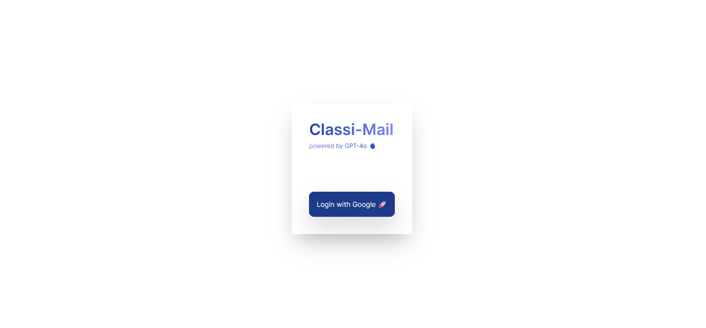

# ClassiMail

##### Streamline your inbox with precision - Let AI categorize your emails effortlessly.



Categorize your emails effortlessly using our GPT-powered web application. Say goodbye to inbox clutter and hello to organized productivity.

## Features

- Google OAuth Login
- View latest e-mails.
- Categorize e-mails using gpt-4o

## Prerequisites

Make sure you have the following installed and available.

- NodeJS & npm
- Git
- API key from Google Cloud Platform

## Getting Started

### Installation

1. Clone the project

```
git clone https://github.com/glaucusec/ClassiMail.git
```

2. Install the dependencies

```
cd ClassiMail
npm install
```

3. Set up environment variables

- Copy and paste the following to the `.env` file.
- Replace the fields with respective `keys`
- For Google Client & Secret Key [visit here](https://developers.google.com/workspace/guides/create-credentials])
- For OpenAI API Key [visit here](https://platform.openai.com/signup)

```
GOOGLE_CLIENT_ID=<INSERT GOOGLE_CLIENT ID HERE>
GOOGLE_CLIENT_SECRET=<INSERT GOOGLE CLIENT SECRET HERE>
AUTH_SECRET=<INSERT AUTH_SECRET HERE>
OPENAI_KEY=<INSERT OPENAI_KEY HERE>
```

4. Run the server

```
npm run dev
```

5. Visit [http://localhost:3000](http://localhost:3000) with your browser to see the result.

## Learn More

To learn more about Next.js, take a look at the following resources:

- [Next.js Documentation](https://nextjs.org/docs) - learn about Next.js features and API.
- [Learn Next.js](https://nextjs.org/learn) - an interactive Next.js tutorial.

You can check out [the Next.js GitHub repository](https://github.com/vercel/next.js/) - your feedback and contributions are welcome!
